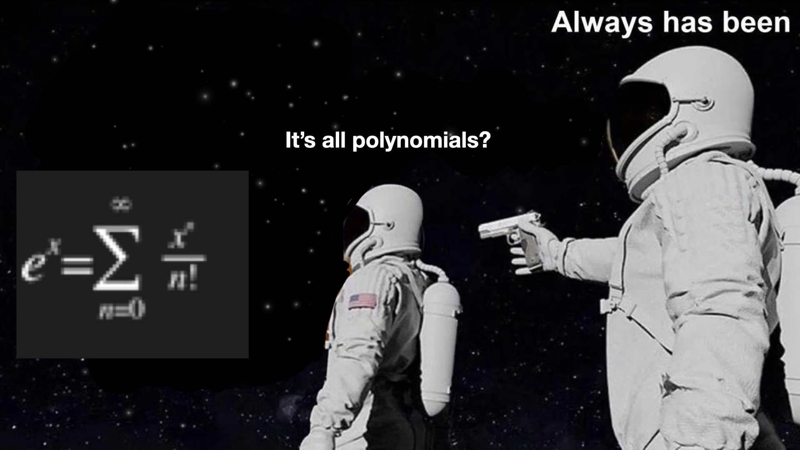
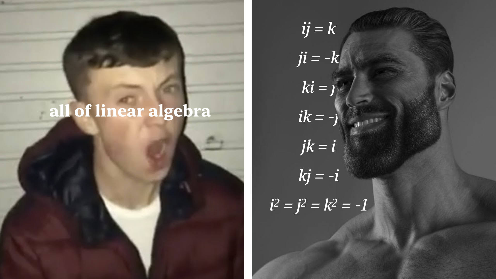

# based math has arrived

*This is a Python math library designed to encode some **very cool** math operations without relying on any other libraries. I know it's slow, it's a personal project and I don't care.*

*In addition to ignoring Python's math and cmath modules and any others, I also chose to ignore Python's `complex` objects and all forms of the exponentiation operator `**`. Everything here is built from scratch; I like my math completely homemade.*

## We have:

- Complex number objects, stored in `(a+bi) -> comp(a,b)`(with `+,-,*,/,**`)

- Polynomial objects, stored as a list of coefficients
 `poly([3,2,1]) == 3x2 + 2x + 1` 
 with `+,-,*,` synthetic division, derivatives and antiderivatives, evalutation, and complete (approximate) solving

- Newton's method of computing complex polynomial solutions and all roots of a number

- The complex exponential function, using a 12-term Taylor polynomial that is accurate for -3 < x < 3

- Logarithms using Newton's method on this Taylor polynomial

- Angle objects (with `+,-`) that display angles in terms of π

- Complex trigonometric functions using the complex exponential function

- Complex inverse trigonometric functions using complex logarithms

- Complex numbers in polar form `r*e^(a*iπ)` (with `*,/`)

- 2D line rendering on a 64x64 grid in the terminal (given two endpoints)

- 3D point rendering (outputting a projected 2D point)

- 3D wireframe objects that can be rotated around all axes

- Quaternions with `+`,`-`,`*`,`/`

- Input space and parameter space fractal plotting in a custom-compressed image format

- Rational fraction objects that auto-simplify with `+`,`-`,`*`,`/`

- A variable `based` thats always `True`

## Math wikipedia to understand functions:

https://en.wikipedia.org/wiki/Calculus

https://en.wikipedia.org/wiki/Complex_analysis

https://en.wikipedia.org/wiki/Newton%27s_method

https://en.wikipedia.org/wiki/Taylor_series

https://en.wikipedia.org/wiki/Exponential_function#Complex_plane

https://en.wikipedia.org/wiki/Complex_logarithm

https://en.wikipedia.org/wiki/Quaternion

https://en.wikipedia.org/wiki/Julia_set

youtube.com/3blue1brown

